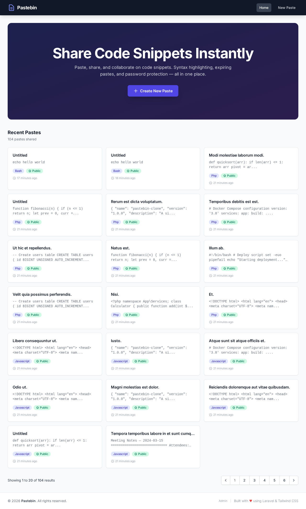
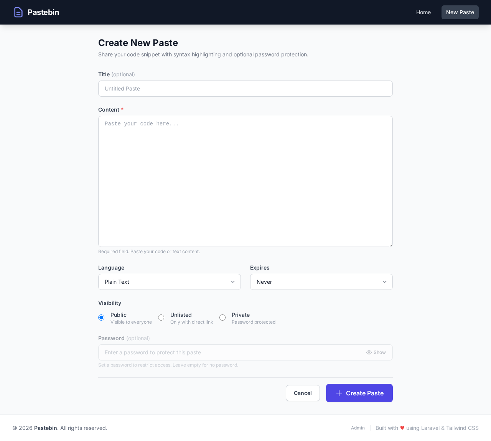

# Pastebin

A self-hosted, elegant pastebin clone — built with Laravel 11, Tailwind CSS, and Docker.

<p align="center">
  
</p>

> 🚀 This project was generated by **[Coder.ltd](https://coder.ltd)** — an AI-powered development platform that builds full-stack applications from natural language prompts. A showcase of what autonomous AI coding agents can create.

---

## Screenshots

| Home Page | Create Paste |
|:---------:|:------------:|
|  |  |

---

## Features

- 📝 **Create pastes** with syntax highlighting, expiry timers, and visibility controls
- 🎨 **15+ languages** — PHP, JavaScript, Python, Ruby, Go, Rust, SQL, and more
- 🔒 **Password protection** — private pastes, burn-after-read, unlisted links
- 📋 **One-click copy** — copy code or share URLs instantly
- 🌐 **REST API** — full CRUD with pagination, language filtering, and Sanctum auth
- 🛡️ **Admin dashboard** — manage, filter, search, and bulk-delete pastes
- 🐳 **Docker ready** — one command to run everything

---

## How to Run

### Prerequisites

- [Docker](https://docs.docker.com/get-docker/) & [Docker Compose](https://docs.docker.com/compose/install/)

### One-Command Start

```bash
docker-compose up -d
```

Then set things up:

```bash
docker-compose exec app composer install
docker-compose exec app php artisan key:generate
docker-compose exec app php artisan migrate --seed
docker-compose exec app npm install && docker-compose exec app npm run build
```

Open **http://localhost:3000** and you're done! 🎉

> **Admin panel:** Go to `/admin` and login with password `admin123` (change `ADMIN_PASSWORD` in `.env` for production).

### Running Without Docker

You'll need PHP 8.2+, Composer, MySQL 8.0+, Redis 7, and Node.js 20+.

```bash
cp .env.example .env           # Edit DB/REDIS credentials
composer install
php artisan key:generate
php artisan migrate --seed
npm install && npm run build
php artisan serve --port=3000
```

---

## API Quickstart

Base URL: `http://localhost:3000/api/v1`

```bash
# List public pastes
curl http://localhost:3000/api/v1/pastes

# Create a paste
curl -X POST http://localhost:3000/api/v1/pastes \
  -H "Content-Type: application/json" \
  -d '{"content": "Hello World!", "language": "php", "expires_at": "never", "visibility": "public"}'

# Get a paste by slug
curl http://localhost:3000/api/v1/pastes/{slug}
```

| Method | Endpoint | Auth |
|--------|----------|------|
| GET | `/api/v1/pastes` | None |
| POST | `/api/v1/pastes` | None |
| GET | `/api/v1/pastes/{slug}` | None |
| DELETE | `/api/v1/pastes/{slug}` | Bearer token |

Rate limit: 60 requests/minute per IP.

---

## Tech Stack

**Backend:** Laravel 11 · PHP 8.2 · MySQL 8.0 · Redis 7  
**Frontend:** Blade · Tailwind CSS v3 · highlight.js · Vite  
**API Auth:** Laravel Sanctum  
**Infra:** Docker · Docker Compose · Nginx Alpine

---

## License

MIT — built for the community. Share, modify, and deploy anywhere.

---

<p align="center">
  <sub>Generated with ❤️ by <a href="https://coder.ltd">Coder.ltd</a></sub>
</p>
